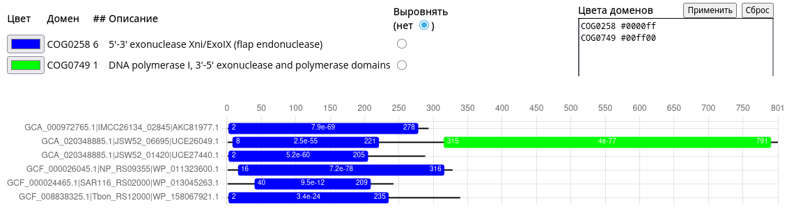

# Log

This file describes what has actually been done.

## COG0258 description

| Field                   | Information                                  |
| ----------------------- | -------------------------------------------- |
| **COG ID**              | **COG0258**                                  |
| **COG name**            | **5'-3' exonuclease Xni/ExoIX**              |
| **COG symbol**          | **ExoIX**                                    |
| **Functional category** | **L — Replication, recombination and repair**|
| **Gene/protein names**  | Xni; ExoIX / exonuclease IX                  |
| **PDB**                 | **3ZDA**                                     |
| **Literature**          | PubMed **19000038**, **23821668**            |

### Representative protein

The biologically characterized reference is **E. coli ExoIX**, encoded by
**xni**. The CDD page also provides representative protein sequences rather
than a single unique "characteristic protein" field. But there is an
experimentally characterized reference: Escherichia coli ExoIX/Xni.

## COG0258 analysis

Target `COG0258` was analysed with
[COGcollator](https://boabio.belozersky.msu.ru/COGcollator) with both filter off
and filter on.


I zoomed into the unfiltered `COG0258` graph in
[COGcollator](https://boabio.belozersky.msu.ru/COGcollator)


and put the selected sequences in
[DomainAnalyzer](https://boabio.belozersky.msu.ru/DomainAnalyser). The part with
non-`COG0258` proteins revealed the following picture:


This explains why `COG0749` was discarded almost entirely when filtering was
applied: it occurs frequently in fusion proteins as a second C-terminal domain.

The 7 remaining `COG0749` sequences also revealed no overlap:


### Result

`COG0258` alone will define the initial COG-derived Xni/FEN homolog set.
No additional COG has been identified as a clearly related paralogous family
requiring inclusion.

## Relevant proteins extraction

The procedure aims to select

$$
\{\text{all COG0258 assignments}\}
\cap
\{\text{assignments from the 275 genomes}\}
$$

and then recover the corresponding amino-acid sequences from `COGorg24.faa`.

In order to accomplish that, I wrote a [parsing script](
    scripts/cog_parser/extract.py
) and ran it with

```sh
extract-cog \
    --cog COG0258 \
    --genomes data/27789-154191-1-SP.xlsx \
    --assignments data/large/cog-24.cog.csv \
    --sequences data/large/COGorg24.faa \
    --output data/COG0258 \
    --suppress-errors
```

which executed successfully

```sh
Representative genomes:       275
Selected COG assignments:     306
Genomes containing the COG:   273
Matched sequences:            306
Ambiguous FASTA records:      0
Duplicate FASTA matches:      0
Unmatched assignments:        0
Output directory:             ~/Desktop/Study/FBB/CourseWork2026/data/COG0258
```

and produced

```sh
data/COG0258/
├── COG0258_275_ambiguous.tsv
├── COG0258_275_raw.faa
├── COG0258_275_raw.tsv
└── COG0258_275_unmatched.tsv
```

- `COG0258_275_ambiguous.tsv` — FASTA records that could not be matched
  unambiguously;
- `COG0258_275_raw.faa` — corresponding amino-acid sequences;
- `COG0258_275_raw.tsv` — metadata for successfully matched assignments;
- `COG0258_275_unmatched.tsv` — selected COG assignments for which no
  sequence was recovered.

There are three source files, and each contributes different information:

```txt
27789-154191-1-SP.xlsx
        │
        │ Which genomes do we want?
        ▼
275 representative
    assemblies
        │
        │
        ├──────────────────────┐
        │                      │
        ▼                      │
  cog-24.cog.csv               │
        │                      │
        │ Which proteins       │
        │ belong to COG0258?   │
        ▼                      │
COG0258 assignments from ◄─────┘
    the 275 genomes
        │
        │ Which sequences correspond
        │ to those assignments?
        ▼
   COGorg24.faa
        │
        ▼
COG0258_275_raw.tsv
COG0258_275_raw.faa
```

### Result

The 2 files with filtered proteins sequences and assignments metadata

```sh
data/COG0258/
├── COG0258_275_raw.faa
└── COG0258_275_raw.tsv
```

## Quality control

[DomainAnalyzer](https://boabio.belozersky.msu.ru/DomainAnalyser) shows the
following picture of the filtered proteins:


To analyze the relevance of the selected proteins, I wrote a [QC script](
    scripts/qc.py
) and ran it with

```sh
cog-qc \
    --metadata data/COG0258/COG0258_275_raw.tsv \
    --sequences data/COG0258/COG0258_275_raw.faa \
    --output data/COG0258/qc
```

which produced

```txt
data/COG0258/qc
├── exclude.faa
├── exclude.tsv
├── keep.faa
├── keep.tsv
├── qc.tsv
├── review.faa
├── review.tsv
└── summary.txt
```

There were 0 proteins excluded automatically and only 6 proteins were scheduled
for manual review.

### Protein review

[DomainAnalyzer](https://boabio.belozersky.msu.ru/DomainAnalyser) shows the
following picture:



The bottom two proteins seem to have lower E-value compared to others.

#### WP_013045263.1

`WP_013045263.1` is annotated as class 2, which means
**Most of protein + part of COG profile**.

Its relevant statistics are

```txt
protein length:       242 aa
protein footprint:    1–242
protein coverage:     100%
COG profile length:   310
profile footprint:    47–248
profile coverage:     65.16%
membership class:     2
E-value (COG):        8.78e-13
DomainAnalyser:       ~40–209, E = 9.5e-12
```

It corresponds to only about 65% of the 310-position COG profile:

```txt
1          47                    248          310
|----------|=====================|-------------|
                WP_013045263.1
```

**Verdict:** insufficient `COG0258` match, exclude.

#### WP_158067921.1

`WP_158067921.1` is annotated as class 2, which means
**Partial protein + partial COG profile**.

Its relevant statistics are

```txt
protein length:       339 aa
protein footprint:    1–225
protein coverage:     66.37%
COG profile length:   310
profile footprint:    13–207
profile coverage:     62.90%
membership class:     3
E-value (COG):        4.04e-21
DomainAnalyser:       ~2–235, E = 3.4e-24
```

The protein itself is not short, instead it is roughly:

```txt
1                 225                339
|==================|------------------|
      COG0258           unassigned
```

And the corresponding profile region is approximately:

```text
1  13                  207                 310
|--|====================|-------------------|
       matched region
```

**Verdict:** partial `COG0258` match, exclude.

### Result

Curated files are saved in

```txt
data/COG0258/curated
├── COG0258_275.faa
└── COG0258_275.tsv
```
